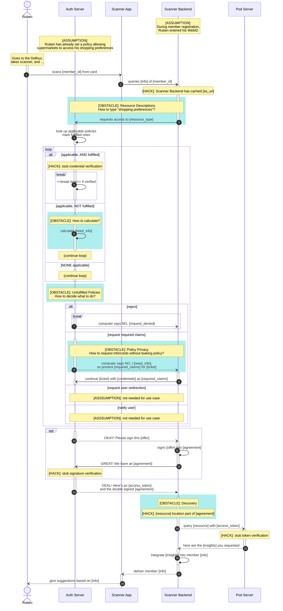

```mermaid
---
config:
  look: classic
---

sequenceDiagram

    actor U as Ruben
    %%participant CA as Companion App
    participant AS as Auth Server
    participant SA as Scanner App
    participant SB as Scanner Backend
    %%participant CI as Credential Issuer(s)
    participant RS as Pod Server
    %%participant CS as Catalog Server

    autonumber

    note over SB: [ASSUMPTION]: <br/> During member registration, <br/> Ruben entered his WebID
    note over AS: [ASSUMPTION]: <br/> Ruben has already set a policy allowing <br/> supermarkets to access his shopping preferences
    note over U: Goes to the Delfour, <br/> takes scanner, and ...

    activate U
    U -) SA: scans [member_id] from card
    deactivate U

    activate SA
    SA -) SB: queries [info] of [member_id]
    deactivate SA

    activate SB
    note over SB: [HACK]: Scanner Backend has cached [as_uri]

    rect paleturquoise
        note over SB,AS: [OBSTACLE]: Resource Descriptions <br/> How to type "shopping preferences"?

        SB -) AS: requests access to [resource_type]
        deactivate SB
    end

    activate AS
    AS ->> AS: look up applicable policies <br/> mark fulfilled ones
    deactivate AS

    loop

        alt applicable, AND fulfilled

            activate AS
            note over AS: [HACK]: stub credential verification

            break
                AS ->> AS: <<break loop>> if verified
            end
            deactivate AS

        else applicable, NOT fulfilled

            rect paleturquoise

                activate AS
                note over AS: [OBSTACLE]: How to calculate?

                AS ->> AS: calculate [need_info]

            end

            note over AS: (continue loop)
            deactivate AS

        else NONE applicable
            activate AS
            note over AS: (continue loop)
        end
            deactivate AS

        rect paleturquoise
            note over AS: [OBSTACLE]: Unfulfilled Policies <br/> How to decide what to do?
        end

        alt reject

            break
                activate AS
                AS --) SB: computer says NO, [request_denied]
                deactivate AS
            end

        else request required claims

            activate AS
            rect paleturquoise
                note over SB,AS: [OBSTACLE]: Policy Privacy <br/> How to request info/creds without leaking policy?
                AS --) SB: computer says NO, I [need_info], <br/> so present [required_claims] for [ticket]
            end
            deactivate AS

            activate SB
            SB -) AS: continue [ticket] with [credentials] as [required_claims]
            deactivate SB

            activate AS
            deactivate AS

        else request user redirection

            note over AS,SB: [ASSSUMPTION]: not needed for use case

        else notify user

            note over AS,SB: [ASSSUMPTION]: not needed for use case

        end


    end

    opt

        activate AS
        AS --) SB: OKAY! Please sign this [offer]
        deactivate AS

        activate SB
        SB ->> SB: signs [offer] into [agreement]
        SB -) AS: GREAT! We have an [agreement]
        deactivate SB

        activate AS
        note over AS: [HACK]: stub signature verification

    end

    AS -->> SB: DEAL! Here's an [access_token] <br/> and the double-signed [agreement]
    deactivate AS

    rect paleturquoise
        activate SB
        note over SB: [OBSTACLE]: Discovery
        note over SB: [HACK]: [resource] location part of [agreement]
    end

    SB --) RS: query [resource] with [access_token]
    deactivate SB

    activate RS
    note over RS: [HACK]: stub token verification
    RS --) SB: here are the [insights] you requested
    deactivate RS

    activate SB
    SB ->> SB: integrate [insights] into member [info]
    deactivate SB

    activate SB
    SB --) SA: deliver member [info]
    deactivate SB

    activate SA
    SA --) U: give suggestions based on [info]
    deactivate SA

```
