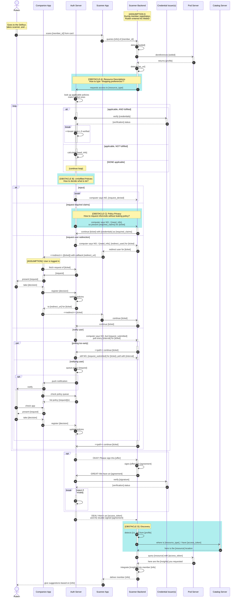

```mermaid
---
config:
  look: classic
---

sequenceDiagram

    actor U as Ruben
    participant CA as Companion App
    participant AS as Auth Server
    participant SA as Scanner App
    participant SB as Scanner Backend
    participant CI as Credential Issuer(s)
    participant RS as Pod Server
    participant CS as Catalog Server

    autonumber

    Note over SB: [ASSUMPTION I]: <br/> During member registration, <br/> Ruben entered his WebID
    %%Note over AS: [ASSUMPTION II]: <br/> Ruben has already set a policy allowing <br/> supermarkets to access his shopping preferences
    Note over U: Goes to the Delfour, <br/> takes scanner, and ...

    activate U
    U -) SA: scans [member_id] from card
    deactivate U

    activate SA
    SA -) SB: queries [info] of [member_id]
    deactivate SA

    activate SB
    SB ->> SB: detects [webid]
    SB -) RS: dereferences [webid]
    deactivate SB

    activate RS
    RS --) SB: returns [profile]
    deactivate RS

    activate SB
    SB ->> SB: detects [as_uri]

    rect paleturquoise
        Note over SB,AS: [OBSTACLE A]: Resource Descriptions <br/> How to type "shopping preferences"?

        SB -) AS: requests access to [resource_type]
        deactivate SB
    end

    activate AS
    AS ->> AS: look up applicable policies <br/> mark fulfilled ones

    loop

        alt applicable, AND fulfilled

            activate AS
            AS -) CI: verify [credentials]
            deactivate AS

            activate CI
            CI --) AS: [verification] status
            deactivate CI

            activate AS
            break
                AS ->> AS: <<break loop>> if verified
            end
            deactivate AS

        else applicable, NOT fulfilled

            activate AS
            AS ->> AS: calculate [need_info]
            deactivate AS

        else NONE applicable
            Note over AS: (continue loop)
        end

        rect paleturquoise
            Note over AS: [OBSTACLE B]: Unfulfilled Policies <br/> How to decide what to do?
        end
        deactivate AS

        alt reject

            break
                activate AS
                AS --) SB: computer says NO, [request_denied]
                deactivate AS
            end

        else request required claims

            activate AS
            rect paleturquoise
                Note over SB,AS: [OBSTACLE C]: Policy Privacy <br/> How to request info/creds without leaking policy?
                AS --) SB: computer says NO, I [need_info], <br/> so present [required_claims] for [ticket]
            end
            deactivate AS

            activate SB
            SB -) AS: continue [ticket] with [credentials] as [required_claims]
            deactivate SB

            activate AS
            deactivate AS

        else request user redirection

            activate AS
            AS --) SB: computer says NO, I [need_info], [redirect_user] for [ticket]
            deactivate AS

            activate SB
            SB --) SA: redirect user for [ticket]
            deactivate SB

            activate SA
            SA -) CA: <<redirect>> ([ticket]) with callback [redirect_uri]
            deactivate SA

            activate CA
            Note over CA: [ASSUMPTION]: User is logged in
            CA -) AS: fetch request of [ticket]
            deactivate CA

            activate AS
            AS -) CA: [request]
            deactivate AS

            activate CA
            CA -) U: present [request]
            deactivate CA


            activate U
            U --) CA: take [decision]
            deactivate U

            activate CA
            CA -) AS: register [decision]
            deactivate CA

            activate AS
            AS ->> AS: update policies
            AS --) CA: to [redirect_uri] for [ticket]
            deactivate AS

            activate CA
            CA --) SA: <<redirect>> [ticket]
            deactivate CA

            activate SA
            SA -) SB: continue [ticket]
            deactivate SA

            activate SB
            SB -) AS: continue [ticket]
            deactivate SB

            activate AS
            deactivate AS

        else notify user

            activate AS
            AS --) SB: computer says NO, but [request_submitted] <br/> poll every [interval] for [ticket]
            deactivate AS

            activate SB
            deactivate SB

            par polling too early

                activate SB
                SB -) AS: <<poll>> continue [ticket]
                deactivate SB

                activate AS
                AS --) SB: still NO, [request_submitted] for [ticket], poll with [interval]
                deactivate AS

                activate SB
                deactivate SB

            and notifying user

                activate AS
                AS ->> AS: queue policy [request]

                opt
                    AS -) CA: push notification
                    deactivate AS

                    activate CA
                    CA -) U: notify

                    activate U
                end

                CA -) AS: check policy queue
                deactivate CA

                activate AS
                AS --) CA: list policy [request](s)
                deactivate AS

                activate CA
                deactivate CA

                U ->> CA: check app

                activate CA
                CA -->> U: present [request]
                deactivate CA

                U --) CA: take [decision]
                deactivate U

                activate CA
                CA --) AS: register [decision]
                deactivate CA

                activate AS
                AS ->> AS: update policies
                deactivate AS

            end

            activate SB
            SB -) AS: <<poll>> continue [ticket]
            deactivate SB

            activate AS
            deactivate AS

        end


    end

    opt

        activate AS
        AS --) SB: OKAY! Please sign this [offer]
        deactivate AS

        activate SB
        SB ->> SB: signs [offer] into [agreement]
        SB -) AS: GREAT! We have an [agreement]
        deactivate SB

        activate AS
        AS -) CI: verify [signature]
        deactivate AS

        activate CI
        CI --) AS: [verification] status
        deactivate CI

        break reject if invalid
            activate AS
            AS ->> AS: ...
            deactivate AS
        end

    end

    activate AS
    AS -->> SB: DEAL! Here's an [access_token] <br/> and the double-signed [agreement]
    deactivate AS

    rect paleturquoise
        Note over SB: [OBSTACLE D]: Discovery

        activate SB
        SB ->> SB: detects [cs_uri] from [profile]
        SB -) CS: where is [resource_type], I have [access_token]
        deactivate SB

        activate CS
        CS --) SB: here is the [resource] location
        deactivate CS
    end

    activate SB
    SB --) RS: query [resource] with [access_token]
    deactivate SB

    activate RS
    RS --) SB: here are the [insights] you requested
    deactivate RS

    activate SB
    SB ->> SB: integrate [insights] into member [info]
    deactivate SB

    activate SB
    SB --) SA: deliver member [info]
    deactivate SB

    activate SA
    SA --) U: give suggestions based on [info]
    deactivate SA
```
